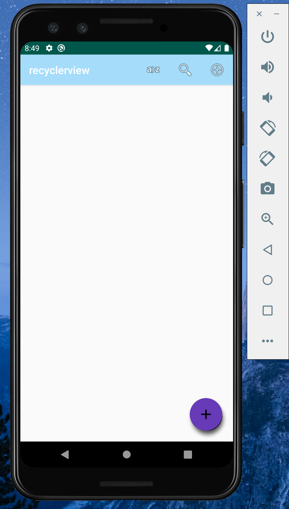
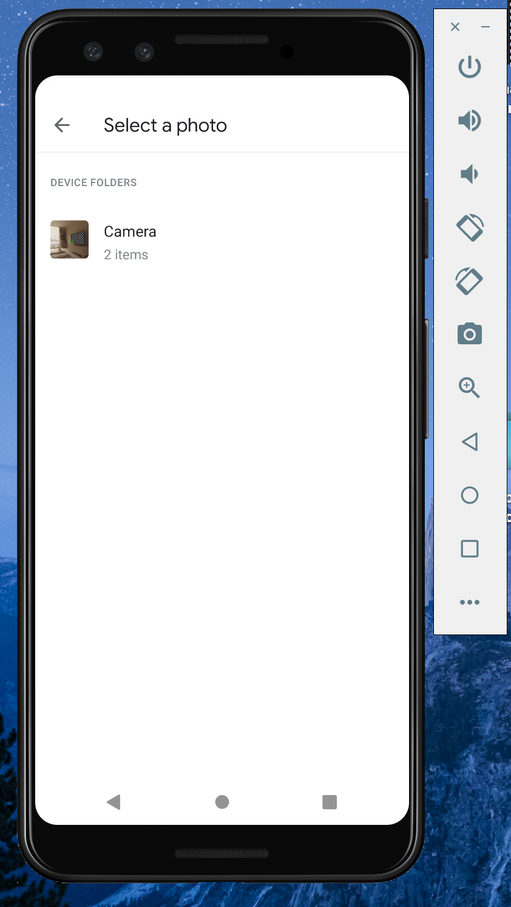
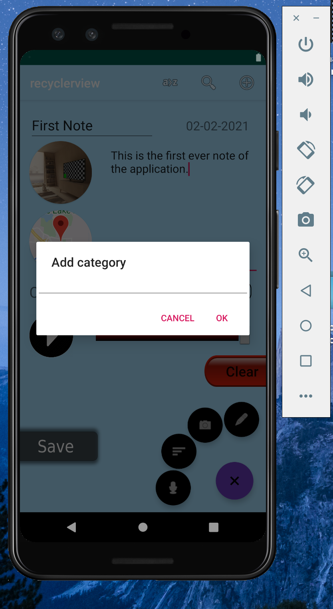
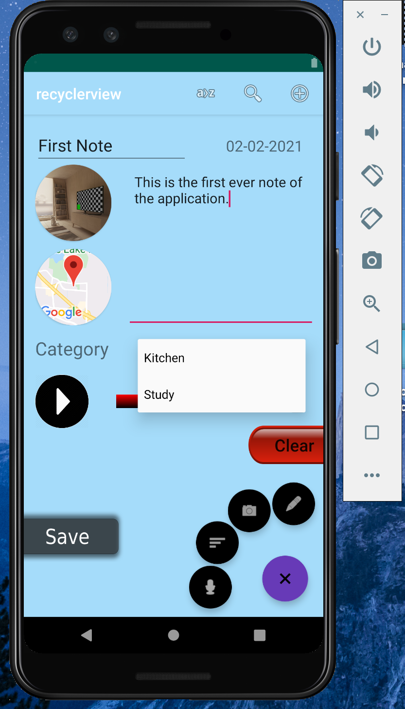
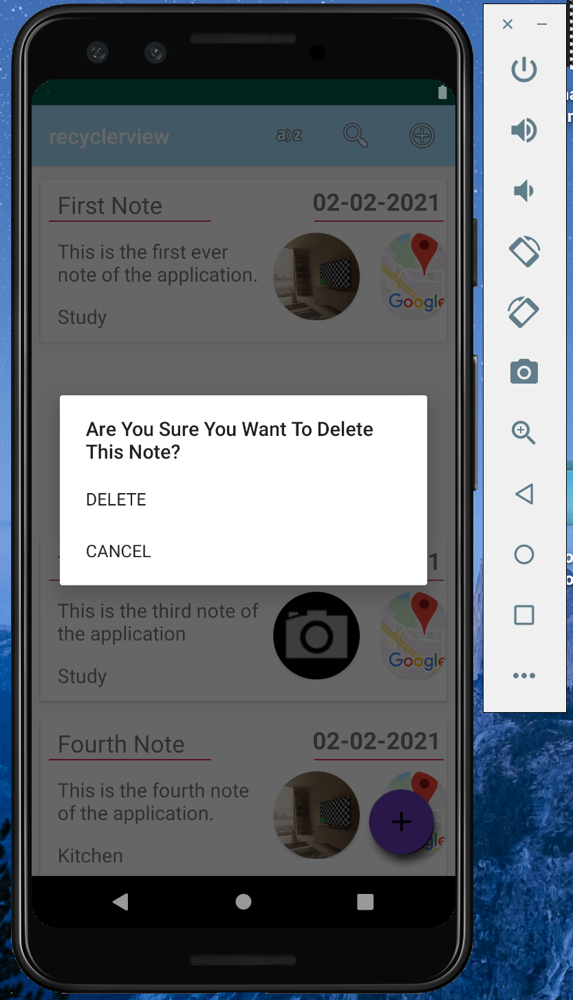
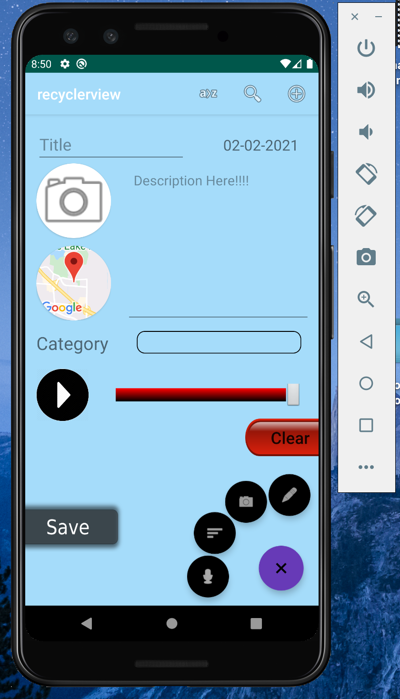

# Quick-Info
My projects

# Overview :
Android application to jot down notes

# Features :
Note down title
Note down description
Selection category of notes
Adding categories to sort notes by
Save location where note was taken
Option to save images and video from gallery and camera
Also allows recording of voice note for future refrence
Notes can be filtered date, name or category wise depending on user prefrenence
Also the ability to search through taken notes by title and description

All above feature can be updated and deleted 
Also added extensive use of animations.

# Backend:
The application uses and SQL database to add update delete notes and all corresponding 
features using DBHelper class and DatabaseAdapter Class

# Insatallion
Download apk file onto android device
Install that file to run the application

